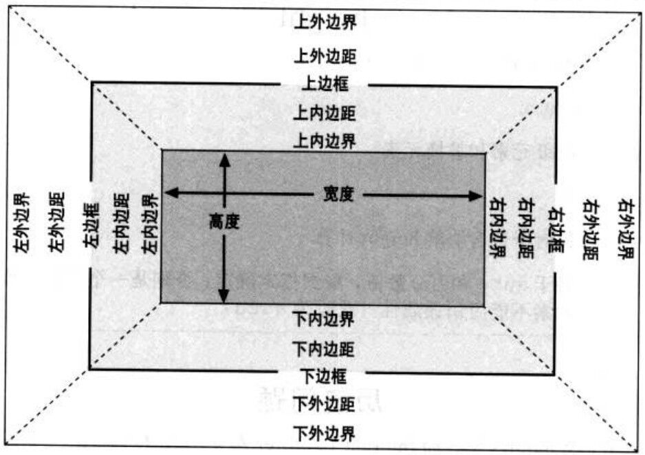

# 盒子模型

## 盒子模型是什么

* 所有的页面元素都可以看成一个盒子，并且占据着一定的页面空间
* 一个页面由很多这样的盒子组成，这些盒子之间会互相影响，因此掌握盒子模型需要从两个方面来理解：一是理解单独一个盒子的内部结构，二是理解多个盒子之间的相互关系。

## 盒子模型的组成

* 每个元素都看成一个盒子，盒子模型是由`content`（内容）、`padding`（内边距）、`margin`（外边距）和`border`（边框）这四个属性组成的。此外，在盒子模型中，还有宽`width`高`height`两大辅助性属性
* `border`
  * （边框）元素边框
* `margin`
  * （外边距）用于定义页面中元素与元素之间的距离
* `padding` 
  * （内边距）用于定义内容与边框之间的距离
  * 内边距 也被称为 **补白**，指的是内容到边框之间的距离
* `content`
  * （内容）可以是文字或图片

