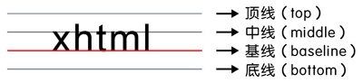

### `text-align:center` 与`margin: 0 auto`的区别

* `text-align:center`实现的是文字、`inlne`元素以及`inline-block`元素的水平居中
* `margin:0 auto`实现的是块元素的水平居中
* `text-align:center`在父元素中定义，`margin:0 auto`在当前元素定义

### 深入`line-height`

**在`css`中我们，使用`line-height`来控制文本的行高，行高，顾名思义就是一行的高度，还有一个更加准确的定义，两行文字的基线之间的距离 **

* 英文本的每一行都有4条线，顶线，中线，基线和底线，如下图

在`css`每一行文字，我们都可以看成一个_行盒子_。每一个行盒子都有这顶线，中线，基线和底线四条线，注意，基线的倒数第二条线。

### 深入`vertical-align`

`w3c`对于`vertical-align`属性定义有4个方面

1. `vertical-align`属性用于定义**周围的文字、inline元素已经inline-block元素**相对于该元素（**指被定义了`vertical-algn的属性的元素`**）基线的垂直对齐方式
2. 在表格单元中，`vertical-align`属性可以定义单元格`td`元素的内容对齐方式，`td`元素是`table-cell`元素，换句话说就是`vertical-align`属性对`table-cell`属性有效
3. `vertical-align`属性对于`inline`元素，`inline-block`元素和`table-cell`元素有效。对块级无效
4. `vertical-align`属性允许支持指定负长度值`-2px`和百分比值