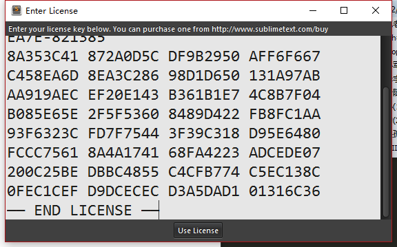

## `激活sublime`

如果安装完`sublime`后出现这么一个东西`UNREGISTERED`,表示未注册激活


没激活的时候有时候会出现购买提示框 ， 那我们为了避免这种情况，有两种方式，一种方法是花`money`购买，还有一种方法可能有点不厚道，就是上网找注册码，我们使用的就是这一种不厚道的方法`,,ԾㅂԾ,,`,希望同学们以后工资提高了，一定要购买正版支持下哦，那我们继续


选择`help` >`enter license`，就会出现下图


然后出现了这个后，选择激活码，直接`Ctrl+C`复制`ctrl+v`粘贴进去，如下图



然后点击`use license`出现下图


点击确定，然后在回头来看，是不是就没了那个`UNREGISTERED`


激活码

```
—– BEGIN LICENSE —–
Michael Barnes
Single User License
EA7E-821385
8A353C41 872A0D5C DF9B2950 AFF6F667
C458EA6D 8EA3C286 98D1D650 131A97AB
AA919AEC EF20E143 B361B1E7 4C8B7F04
B085E65E 2F5F5360 8489D422 FB8FC1AA
93F6323C FD7F7544 3F39C318 D95E6480
FCCC7561 8A4A1741 68FA4223 ADCEDE07
200C25BE DBBC4855 C4CFB774 C5EC138C
0FEC1CEF D9DCECEC D3A5DAD1 01316C36
—— END LICENSE ——
```


