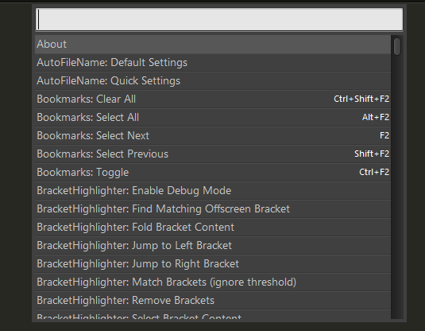
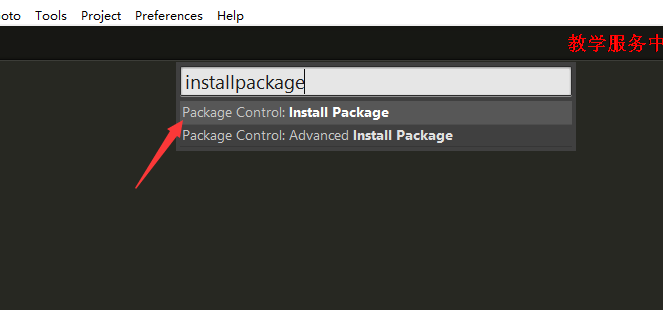
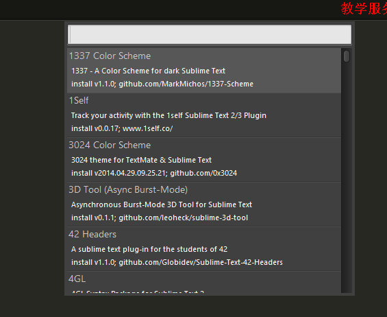
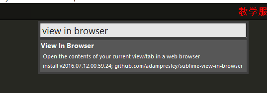
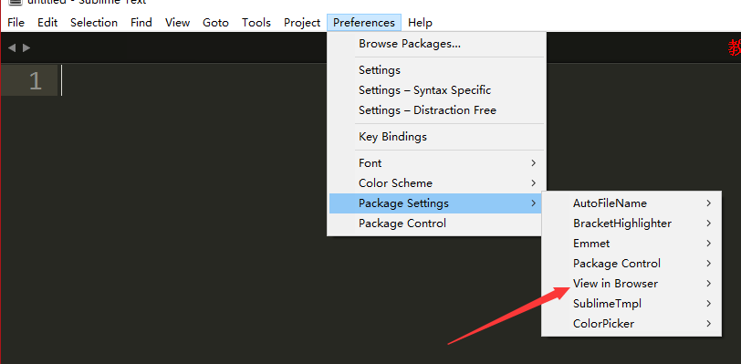
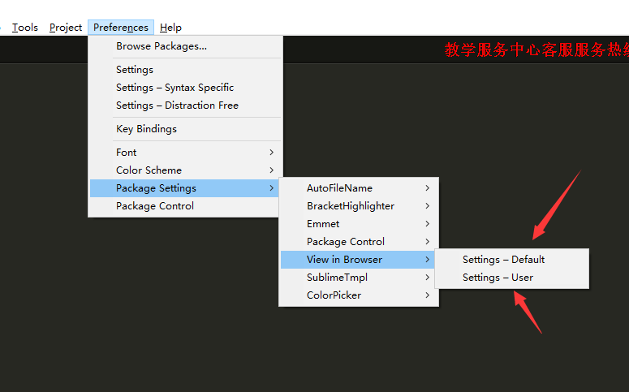
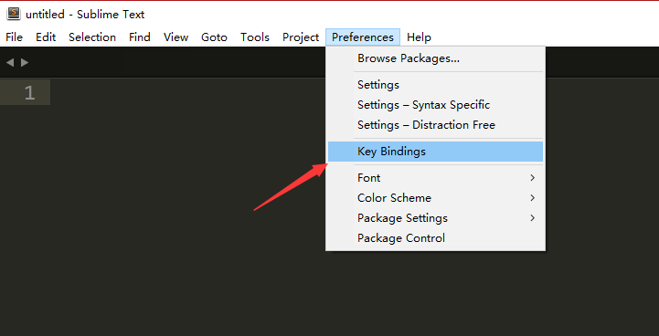

## 插件补充

#### `view in browser`

首先输入`ctrl+shift+p`出现包控制台,如图



接下来输入`install package`,如图，选中第一个，按回车



然后会出现这么一个画面,如图,网不好的同学要等那么几分钟，这时候注意看`sublime`左下角是不是有`=`在来回转动，转完了就会出现下面界面



出现了以上页面，然后输入`view in browser`，然后就会出现



然后回车安装，安装完后，你的`preferences`>`package Settings` 下面就会显示一个`view_in_browser`



然后后面有两个配置，一个是用户(`user`)配置，一个是默认(`default`)配置



我们先点击`settings-Default`然后把里面的内容,选择复制

```json
"nt": {
		"win32": {
			"firefox": "C:\\Program Files (x86)\\Mozilla Firefox\\firefox.exe -new-tab",
			"iexplore": "C:\\Program Files\\Internet Explorer\\iexplore.exe",
			"chrome": "C:\\Program Files (x86)\\Google\\Chrome\\Application\\chrome.exe",
			"chrome64": "C:\\Program Files (x86)\\Google\\Chrome\\Application\\chrome.exe",
			"yandex": "%Local AppData%\\Yandex\\YandexBrowser\\browser.exe"
		}
	},

	"browser": "firefox"
```

然后点击用户设置,把内容粘贴进去，然后改变对应的文件的路径

```json
{
	"nt": {
		"win32": {
			"firefox": "G:\\Program Files (x86)\\Mozilla Firefox\\firefox.exe",
			"iexplore": "C:\\Program Files\\Internet Explorer\\iexplore.exe",
			"chrome": "C:\\Program Files (x86)\\Google\\Chrome\\Application\\chrome.exe",
			"chrome64": "C:\\Program Files (x86)\\Google\\Chrome\\Application\\chrome.exe",
			"yandex": "%Local AppData%\\Yandex\\YandexBrowser\\browser.exe",
			"opera" : "G:\\Program Files (x86)\\Opera\\launcher.exe",
		}
	},

	"browser": "chrome"
}
```

然后就是



在里面写入以下代码

```json
{ "keys": [ "ctrl+alt+f" ], "command": "view_in_browser", "args": { "browser": "firefox" } },
{ "keys": [ "f12" ], "command": "view_in_browser", "args": { "browser": "chrome" } },
{ "keys": [ "ctrl+alt+i" ], "command": "view_in_browser", "args": { "browser": "iexplore" } },
```

**keys**表示快捷键

**command**表示插件名字

**args**表示参数，后面写上定义的名字